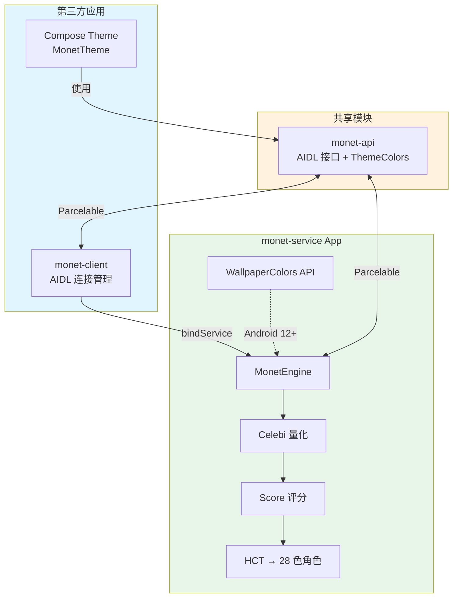

# MonetCore

[](https://github.com/Capslock800000/MonetCore/actions)
[](https://opensource.org/licenses/Apache-2.0)
[](https://kotlinlang.org/)
[](https://developer.android.com/about/versions/9)

跨应用 Material 3 动态主题引擎。基于 Google 官方 HCT 色彩空间，通过 AIDL 向第三方应用提供主题生成服务。

## 核心特性

- **Google 官方算法**：HCT 色彩空间 + QuantizerCelebi 量化 + Score 评分，与 Pixel 系统 Monet 同源
- **双模式支持**：浅色 / 深色主题一键切换
- **多源取色**：系统壁纸、本地图片、指定色值
- **跨进程服务**：AIDL 绑定，支持 Android 9–15
- **零 GPL 依赖**：全部依赖 Apache 2.0

## 架构



## 模块说明

| 模块 | 类型 | 说明 |
|------|------|------|
| `monet-api` | Android Library | AIDL 接口 + `ThemeColors` 数据模型（`@Parcelize`） |
| `monet-service` | Android App | 主题生成服务，需独立安装 |
| `monet-client` | Android Library | SDK：AIDL 连接管理 + Compose 主题集成 |

## 快速开始

### 1. 依赖

```kotlin
// settings.gradle.kts
dependencyResolutionManagement {
    versionCatalogs {
        create("libs") {
            from("com.monettheme:monet-catalog:1.0.0")
        }
    }
}

// build.gradle.kts
dependencies {
    implementation("com.monettheme:monet-client:1.0.0")
}
```

### 2. 权限

```xml
<uses-permission android:name="com.monettheme.permission.GENERATE_THEME" />
```

### 3. 调用

```kotlin
import com.monettheme.client.MonetColorClient
import com.monettheme.api.ThemeColors

val client = MonetColorClient(context)

lifecycleScope.launch {
    if (client.connect()) {
        val bundle = client.generateThemeFromWallpaper(darkTheme = false)
        val theme = ThemeColors.fromBundle(bundle)

        theme?.let {
            setContent {
                MonetTheme(colors = it) {
                    YourAppContent()
                }
            }
        }
        client.disconnect()
    } else {
        Toast.makeText(context, "请先安装 Monet Theme Service", Toast.LENGTH_LONG).show()
    }
}
```

### 4. 从图片生成

```kotlin
val bundle = client.generateThemeFromColor(seedColor = 0xFF6750A4.toInt(), darkTheme = true)
val theme = ThemeColors.fromBundle(bundle)
```

## 技术栈

| 组件 | 版本 |
|------|------|
| AGP | 9.2.1 |
| Gradle | 9.6.1 |
| Kotlin | 2.4.10 |
| compileSdk | 37 |
| minSdk | 28 |
| Material3 | 1.4.0 |
| MDC-Android | 1.12.0（内嵌 color-utilities） |

## 构建

```bash
# 全量构建
./gradlew build

# 单独模块
./gradlew :monet-api:assembleRelease
./gradlew :monet-client:assembleRelease
./gradlew :monet-service:assembleRelease
```

## 许可证

Apache License 2.0 — 详见 [LICENSE](LICENSE)
